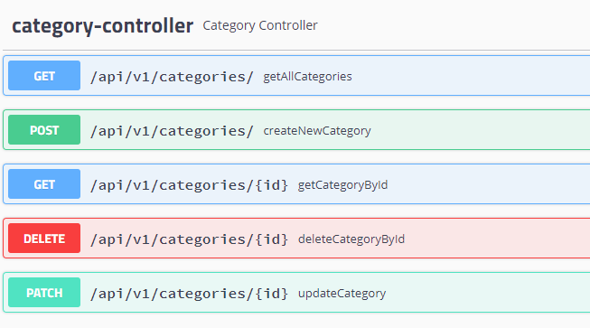
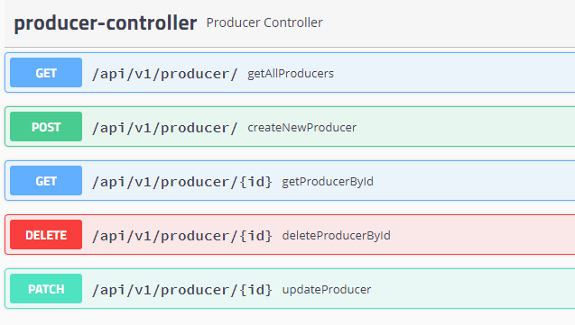
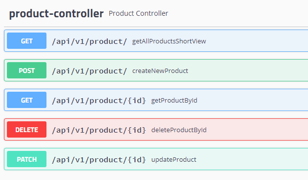

# REST API for Shop
## Table of contents
* [General info](#general-info)
* [Technologies](#technologies)
* [Setup](#setup)
* [Features](#features)
* [Author](#author)
* [Screenshots](#screenshots)

## General info
**This project is a REST API created for shop with Spring**

## Technologies
Project is created with:
* Java version 11.0
* Spring Boot version 2.3.1
* Spring Data
* Spring Web
* Spring MVC
* H2 Database version 1.4.200
* JUnit 5
* Mockito
* MapStruct 
* Swagger

## Setup
To open and run this project, follow this commands:
1. git clone https://github.com/wlazlok/shop-api-REST.git
2. cd .\shop-api-REST\
3. mvn spring-boot:run

Then u can test features using eg. Postman

To show Api Documentation:
1. git clone https://github.com/wlazlok/shop-api-REST.git
2. cd .\shop-api-REST\
3. mvn spring-boot:run
4. open at browser: http://localhost:8080/swagger-ui.html#/

## Features
1. Category
     - Create new category
     - Show list of all categories
     - Show details of each cateogry
     - Delete category
     - Update category
     
2. Producer
     - Create new producer
     - Show list of all producers
     - Show details of each producer
     - Delete producer
     - Update producer
     
3. Product (each product contain producer nad category)
     - Create new product
     - Show list of all products
     - Show details of each product
     - Delete product
     - Update product

## Author
* **[Karol Wlazło](https://github.com/wlazlok)**
* **email:** kwlazo9@gmail.com

## Screenshots

